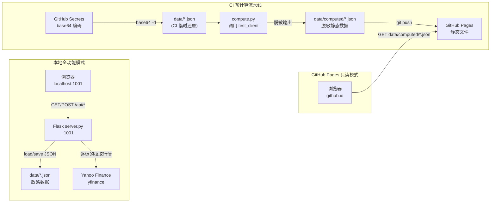
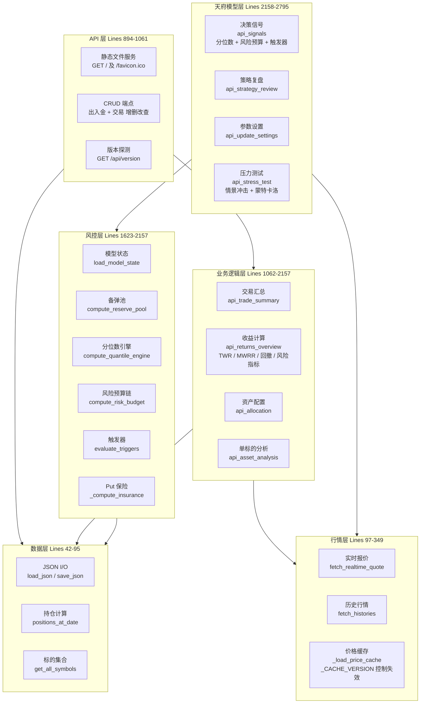
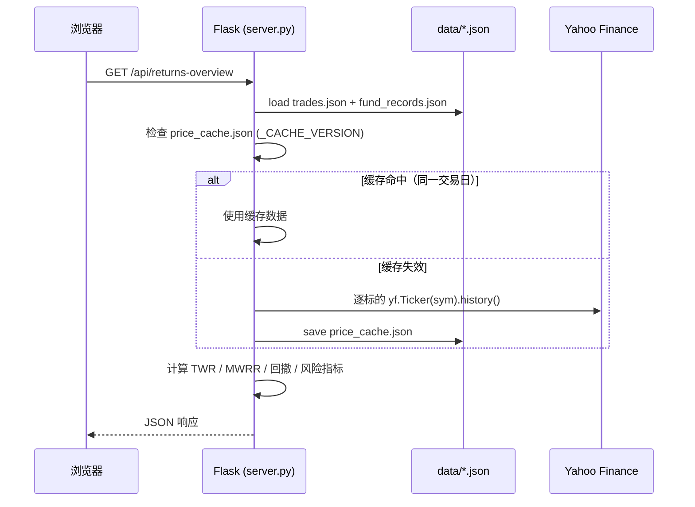
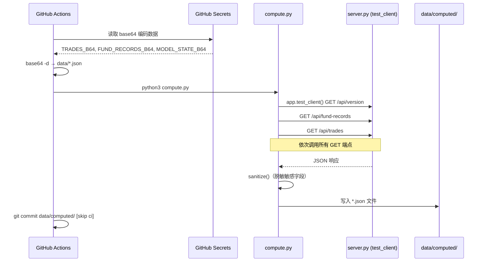
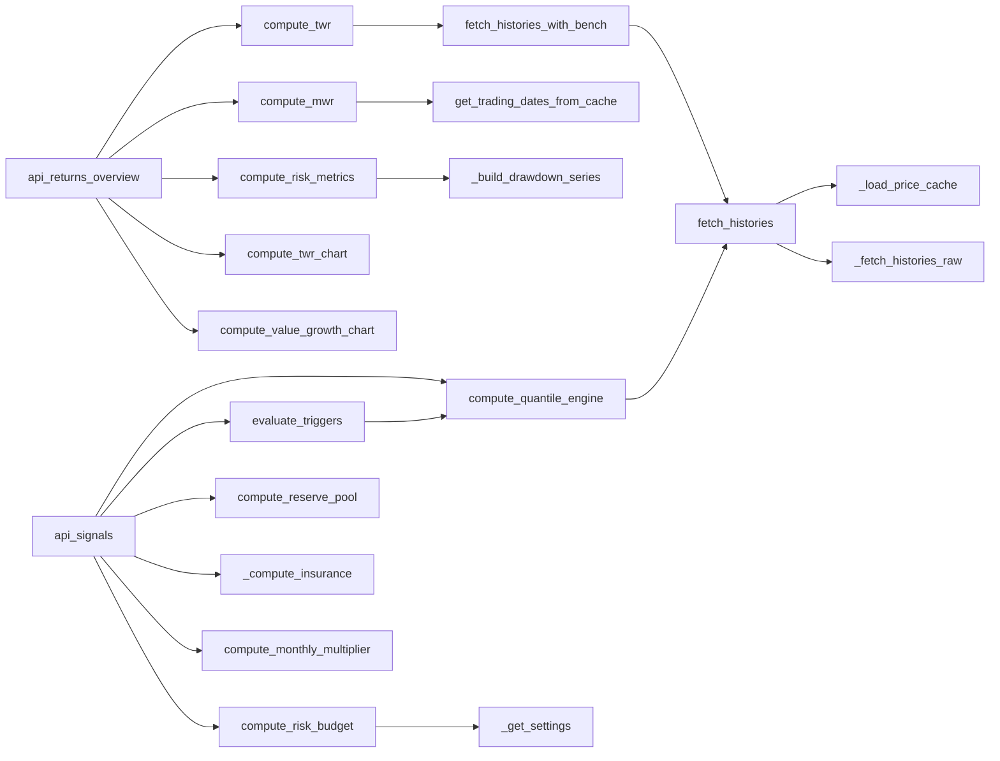
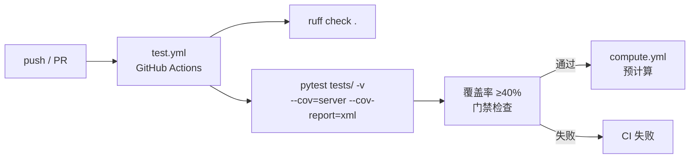

# ARCHITECTURE.md — 系统架构

> 相关文档：[CLAUDE.md](CLAUDE.md) 项目说明书 · [DESIGN.md](DESIGN.md) 页面样式 · [TECHNICAL.md](TECHNICAL.md) 技术细节

---

## 技术栈总览

| 层面 | 技术 | 版本 | 说明 |
|------|------|------|------|
| **后端语言** | Python | ≥3.11 | pandas/numpy 生态适合金融计算 |
| **Web 框架** | Flask | ≥3.0 | 轻量，个人工具无需重框架 |
| **跨域** | flask-cors | ≥4.0 | 本地开发 CORS 支持 |
| **数据分析** | pandas | ≥2.0 | 时间序列、收益率、回撤计算 |
| **数值计算** | numpy | ≥1.20 | 蒙特卡洛模拟等随机数值计算 |
| **行情源** | yfinance | ≥0.2.36 | Yahoo Finance，免费无 Key |
| **科学计算** | scipy | ≥1.10 | yfinance repair 功能依赖 |
| **前端框架** | 无（原生 JS） | - | 单页应用，无构建工具链 |
| **CSS 框架** | Tailwind CSS | 4.x CDN | 工具类，无需编译 |
| **图表库** | Chart.js | 4.4.1 CDN | 轻量声明式，响应式 |
| **图标库** | Font Awesome | 6.5.1 CDN | 丰富图标 |
| **存储** | JSON 文件 | - | 无数据库，读写简单，易 base64 |
| **CI/CD** | GitHub Actions | - | 自动预计算 + 推送静态结果 |
| **静态托管** | GitHub Pages | - | 免费，配合脱敏实现公开只读展示 |

---

## 双模式运行架构



前端通过 `window.location.hostname` 检测运行模式：`github.io` 域名触发云端只读模式。

### 公司行为（分红 / 拆股）

- **数据源**：本地模式下 `server.sync_corp_actions_from_yfinance` 逐标的调用 `yfinance.Ticker(sym).dividends` 与 `.splits`（仍保持逐标的拉取，不使用批量 `yf.download` 多标的）。
- **写入**：结果追加至 `data/trades.json`，字段含 `type`（`分红` | `合股拆股`）、`auto: true`、`source: yfinance`；拆股另含 `split_ratio`。
- **语义**：`compute_cost_basis` 对分红/拆股只调整股数、不增减 `total_cost`；`compute_mwr`、`api_trade-summary` 佣金汇总、`compute_twr_chart` 加仓散点与 `api/asset-analysis` 中加仓散点/归因排除公司行为行。
- **CI**：`compute.py` 在拉取各 GET 端点之前先 `POST /api/corp-actions/sync`，保证静态 JSON 与本地逻辑一致。

| 模式 | 触发条件 | 读数据 | 写数据 |
|------|----------|--------|--------|
| 本地模式 | `localhost` 或 `file://` | Flask API | Flask API |
| 云端模式 | `github.io` 域名 | 静态 `data/computed/*.json` | 不可用（只读展示）|

---

## 服务划分

`server.py` 约 2800 行，按逻辑层划分为 5 个服务区：



### 各层职责说明

| 层 | 行号区间 | 主要函数 | 职责 |
|----|----------|----------|------|
| **数据层** | 42–95 | `load_json`, `save_json`, `get_fund_records`, `get_trades`, `positions_at_date`, `get_all_symbols` | JSON 文件读写、持仓快照、标的集合 |
| **行情层** | 97–349 | `fetch_realtime_quote`, `fetch_histories`, `_load_price_cache`, `_save_price_cache` | Yahoo 行情拉取、日级价格缓存、历史序列处理 |
| **API 层** | 894–1061 | `index`, `api_version`, `api_fund_records*`, `api_trades*` | 静态文件服务、CRUD 路由、版本探测 |
| **业务逻辑层** | 1062–2157 | `api_trade_summary`, `api_returns_overview`, `api_allocation`, `api_asset_analysis` | TWR/MWRR 计算、回撤分析、资产配置、单标的分析 |
| **风控层** | 1623–2157 | `compute_reserve_pool`, `compute_quantile_engine`, `compute_risk_budget`, `evaluate_triggers`, `_compute_insurance` | 天府模型辅助计算：分位、风险预算、触发器、熔断、保险 |
| **天府模型层** | 2158–2795 | `api_signals`, `api_strategy_review`, `api_update_settings`, `api_stress_test` | 决策信号输出、策略复盘、参数管理、压力测试 |

---

## 数据流

### 本地模式数据流



### CI 预计算数据流



---

## 模块关系

### 核心计算函数依赖



---

## API 端点总览

| 方法 | 路径 | 函数 | 行号 | 说明 |
|------|------|------|------|------|
| GET | `/api/version` | `api_version` | 907 | 能力探测 + 版本号 |
| GET | `/api/fund-records` | `api_fund_records` | 913 | 出入金列表 |
| POST | `/api/fund-records` | `api_fund_records_post` | 919 | 新增出入金 |
| POST | `/api/fund-records/delete` | `api_fund_records_delete` | 938 | 删除出入金 |
| POST | `/api/fund-records/update` | `api_fund_records_update` | 954 | 修改出入金 |
| GET | `/api/trades` | `api_trades` | 979 | 交易列表 |
| POST | `/api/trades` | `api_trades_post` | 985 | 新增交易 |
| POST | `/api/trades/delete` | `api_trades_delete` | 1013 | 删除交易 |
| POST | `/api/trades/update` | `api_trades_update` | 1029 | 修改交易 |
| GET | `/api/trade-summary` | `api_trade_summary` | 1063 | 交易汇总（all/year/month）|
| GET | `/api/returns-overview` | `api_returns_overview` | 1131 | 收益概览（TWR/MWRR/对比/回撤）|
| GET | `/api/allocation` | `api_allocation` | 1358 | 资产配置 |
| GET | `/api/asset-analysis/<symbol>` | `api_asset_analysis` | 1433 | 单标的分析 |
| GET | `/api/signals` | `api_signals` | 2159 | 天府模型信号与决策中心 |
| GET | `/api/strategy-review` | `api_strategy_review` | 2407 | 策略复盘 |
| POST | `/api/update-settings` | `api_update_settings` | 2612 | 更新模型设置 |
| GET | `/api/stress-test` | `api_stress_test` | 2639 | 压力测试 + 蒙特卡洛 |

---

## 文件产物清单

### 核心源码

| 文件 | 行数 | 说明 |
|------|------|------|
| `server.py` | ~2800 | Flask 后端，承载全部 API 与业务逻辑 |
| `index.html` | - | 唯一前端页面，内联 Tailwind + Chart.js + JS |
| `compute.py` | ~250 | 预计算脚本，调用 API 并脱敏输出静态 JSON |
| `requirements.txt` | 6 | 生产依赖声明 |
| `requirements-dev.txt` | - | 开发/测试依赖（pytest, pytest-cov, ruff）|

### 启动脚本

| 文件 | 说明 |
|------|------|
| `run.py` | Python 一键脚本（安装依赖 + 启动 + 打开浏览器）|
| `run.sh` | Mac/Linux shell 启动脚本 |
| `启动天府助手.command` | macOS 双击启动（.command 格式）|

### 数据文件 — 敏感（.gitignore 排除）

| 文件 | 字段 | 说明 |
|------|------|------|
| `data/trades.json` | date, symbol, action, price, shares, commission, type | 交易记录 |
| `data/fund_records.json` | date, amount, note | 出入金记录 |
| `data/model_state.json` | settings, reserve_pool, ... | 天府模型状态 + 用户设置 |
| `data/price_cache.json` | version, date, prices | yfinance 日级价格缓存 |

CI 中通过 GitHub Secrets（base64 编码）恢复，变量名：`TRADES_B64` / `FUND_RECORDS_B64` / `MODEL_STATE_B64`。

### 数据文件 — 预计算（已提交，脱敏）

| 文件 | 对应 API |
|------|----------|
| `data/computed/version.json` | `/api/version` |
| `data/computed/fund-records.json` | `/api/fund-records` |
| `data/computed/trades.json` | `/api/trades` |
| `data/computed/allocation.json` | `/api/allocation` |
| `data/computed/returns-overview.json` | `/api/returns-overview` |
| `data/computed/signals.json` | `/api/signals` |
| `data/computed/stress-test.json` | `/api/stress-test` |
| `data/computed/trade-summary-all.json` | `/api/trade-summary?period=all` |
| `data/computed/trade-summary-year.json` | `/api/trade-summary?period=year` |
| `data/computed/trade-summary-month.json` | `/api/trade-summary?period=month` |
| `data/computed/strategy-review-all.json` | `/api/strategy-review?period=all` |
| `data/computed/strategy-review-3m.json` | `/api/strategy-review?period=3m` |
| `data/computed/strategy-review-1m.json` | `/api/strategy-review?period=1m` |
| `data/computed/asset-analysis-<symbol>.json` | `/api/asset-analysis/<symbol>`（每只持仓标的各一份）|

### 数据文件 — 历史回测（已提交，无敏感字段）

由 `scripts/import_backtest.py` 从回测 Excel 导出，前端策略复盘「历史回测」子 Tab 直接 `fetch`（不经 Flask、不进 `compute.py`）。

| 文件 | 说明 |
|------|------|
| `data/backtest/v1.3.1-{10y,20y,30y}-summary.json` | 元数据、汇总指标、Top-3 回撤段；`--enrich-benchmark` 后含 `benchmark`（QQQ / `^IXIC` proxy / 月定投元数据等） |
| `data/backtest/v1.3.1-{10y,20y,30y}-nav.json` | 每日净值序列；可选 enrich 字段 `port_ret_pct`、`qqq_bh_pct`、`qqq_dca_pct`（供前端收益率对比图） |
| `data/backtest/v1.3.1-{10y,20y,30y}-trades.json` | 交易明细 |

### CI/CD 配置

| 文件 | 说明 |
|------|------|
| `.github/workflows/compute.yml` | 自动预计算流水线 |
| `.github/workflows/test.yml` | 自动化测试流水线（规划中）|
| `sync-secrets.sh` | 本地 → GitHub Secrets 同步脚本 |

### 配置与元数据

| 文件 | 说明 |
|------|------|
| `.gitignore` | 排除敏感数据、Python 缓存、IDE 文件、OS 文件 |
| `README.md` | 项目说明与使用指南 |
| `CLAUDE.md` | 项目说明书（AI 协作 + 编码规范）|
| `ARCHITECTURE.md` | 本文件：系统架构 |
| `DESIGN.md` | 页面样式与交互规范 |
| `TECHNICAL.md` | 技术深度文档 |
| `AGENTS.md` | Cursor workspace rule（AI 协作关键约定）|

---

## 依赖清单

### 生产依赖（requirements.txt）

| 包 | 版本要求 | 用途 |
|----|----------|------|
| flask | ≥3.0.0 | Web 框架与路由 |
| flask-cors | ≥4.0.0 | 跨域支持 |
| pandas | ≥2.0.0 | 时间序列与金融计算 |
| numpy | ≥1.20.0 | 蒙特卡洛模拟等数值计算 |
| yfinance | ≥0.2.36 | Yahoo Finance 行情拉取 |
| scipy | ≥1.10.0 | yfinance repair 功能的可选依赖 |

### 开发依赖（requirements-dev.txt，规划中）

| 包 | 版本要求 | 用途 |
|----|----------|------|
| pytest | ≥8.0.0 | 测试框架 |
| pytest-cov | ≥5.0.0 | 覆盖率报告 |
| ruff | ≥0.4.0 | Lint + 代码格式化 |

### 前端 CDN 依赖

| 库 | 版本 | CDN 地址 | 用途 |
|----|------|----------|------|
| Tailwind CSS | 最新 | cdn.tailwindcss.com | 工具类样式框架 |
| Chart.js | 4.4.1 | jsdelivr | 收益/配置/回撤等图表 |
| Font Awesome | 6.5.1 | cdnjs | 图标 |

---

## 测试架构

> 详细测试方案见 [TECHNICAL.md](TECHNICAL.md#测试)

### 测试目录结构（规划）

```
tests/
  conftest.py             # pytest fixture：数据隔离、Mock yfinance
  fixtures/
    trades.json           # 标准化样本交易数据（含多种 action 类型）
    fund_records.json     # 标准化样本出入金数据
    model_state.json      # 标准化样本模型状态
  test_crud.py            # CRUD 接口测试（出入金 + 交易增删改查 + 边界条件）
  test_readonly_api.py    # 只读 API 测试（全部 GET 端点）
  test_business.py        # 核心业务逻辑单元测试（TWR/MWRR/风险指标/蒙特卡洛）
  test_compute.py         # compute.py 脱敏验证 + 预计算输出完整性
```

### CI 测试流水线（规划）


