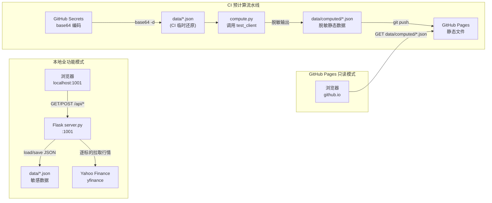
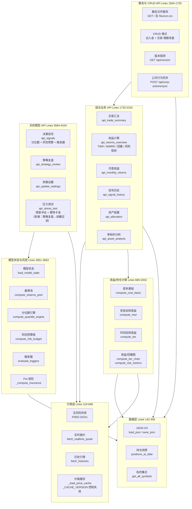
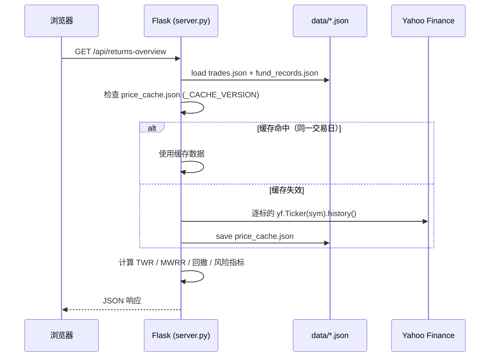
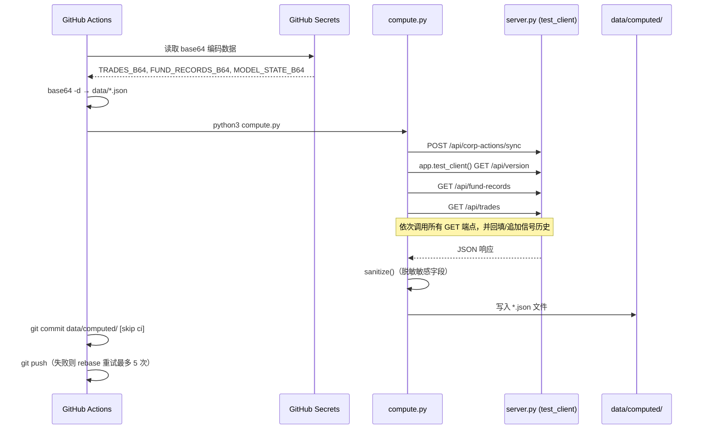
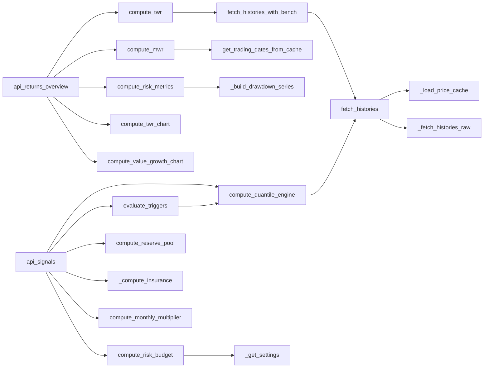

# ARCHITECTURE.md — 系统架构

> 相关文档：[CLAUDE.md](CLAUDE.md) 项目说明书 · [DESIGN.md](DESIGN.md) 页面样式 · [TECHNICAL.md](TECHNICAL.md) 技术细节

---

## 技术栈总览

| 层面 | 技术 | 版本 | 说明 |
|------|------|------|------|
| **后端语言** | Python | 推荐 3.11 | CI 使用 3.11；本地 `python3` 当前可在 macOS 3.9.6 通过测试 |
| **Web 框架** | Flask | ≥3.0 | 轻量，个人工具无需重框架 |
| **跨域** | flask-cors | ≥4.0 | 本地开发 CORS 支持 |
| **数据分析** | pandas | ≥2.0 | 时间序列、收益率、回撤计算 |
| **数值计算** | numpy | ≥1.20 | 蒙特卡洛模拟等随机数值计算 |
| **行情源** | yfinance | ≥0.2.36 | Yahoo Finance，免费无 Key |
| **科学计算** | scipy | ≥1.10 | yfinance repair 功能依赖 |
| **Excel 处理** | openpyxl | ≥3.1 | 历史回测导入等表格处理 |
| **前端框架** | 无（原生 JS） | - | 单页应用，无 Node.js / npm / 构建工具链 |
| **CSS 框架** | Tailwind CSS | 4.x CDN | 工具类，无需编译 |
| **图表库** | Chart.js | 4.4.1 CDN | 轻量声明式，响应式 |
| **图标库** | Font Awesome | 6.5.1 CDN | 丰富图标 |
| **存储** | JSON 文件 | - | 无数据库，读写简单，易 base64 |
| **CI/CD** | GitHub Actions | - | 自动预计算 + 推送静态结果 |
| **静态托管** | GitHub Pages | - | 免费，配合脱敏实现公开只读展示 |

---

## 双模式运行架构


```mermaid
graph LR
    subgraph local [本地全功能模式]
        Browser1["浏览器\nlocalhost:1001"]
        Flask["Flask server.py\n:1001"]
        DataFiles["data/*.json\n敏感数据"]
        YF["Yahoo Finance\nyfinance"]
        Browser1 -->|"GET/POST /api/*"| Flask
        Flask -->|"load/save JSON"| DataFiles
        Flask -->|"逐标的拉取行情"| YF
    end

    subgraph ci [CI 预计算流水线]
        Secrets["GitHub Secrets\nbase64 编码"]
        Compute["compute.py\n调用 test_client"]
        Computed["data/computed/*.json\n脱敏静态数据"]
        Secrets -->|"base64 -d"| DataFiles2["data/*.json\n(CI 临时还原)"]
        DataFiles2 --> Compute
        Compute -->|"脱敏输出"| Computed
        Computed -->|"git push"| Pages
    end

    subgraph cloud [GitHub Pages 只读模式]
        Browser2["浏览器\ngithub.io"]
        Pages["GitHub Pages\n静态文件"]
        Browser2 -->|"GET data/computed/*.json"| Pages
    end
```

前端通过 `window.location.hostname` 检测运行模式：`github.io` 域名触发云端只读模式。

### 公司行为（分红 / 拆股）

- **数据源**：本地模式下 `server.sync_corp_actions_from_yfinance` 逐标的调用 `yfinance.Ticker(sym).dividends` 与 `.splits`（仍保持逐标的拉取，不使用批量 `yf.download` 多标的）。
- **写入**：结果追加至 `data/trades.json`，字段含 `type`（`分红` | `合股拆股`）、`auto: true`、`source: yfinance`；拆股另含 `split_ratio`。
- **语义**：`compute_cost_basis` 对分红/拆股只调整股数、不增减 `total_cost`；`compute_mwr`、`api_trade-summary` 佣金汇总、`compute_twr_chart` 加仓散点与 `api/asset-analysis` 中加仓散点/归因排除公司行为行。
- **CI**：`compute.py` 在拉取各 GET 端点之前先 `POST /api/corp-actions/sync`，保证静态 JSON 与本地逻辑一致。

| 模式 | 触发条件 | 读数据 | 写数据 |
|------|----------|--------|--------|
| 本地模式 | `localhost` 或 `file://` | Flask API | Flask API |
| 云端模式 | `github.io` 域名 | 静态 `data/computed/*.json` | 不可用（只读展示）|

### 前端模块组织

`index.html` 是唯一页面入口，实际只通过 `<script type="module" src="js/main.js">`
加载前端逻辑。`js/main.js` 是拼接产物，源文件按职责拆在：

| 源文件 | 职责 |
|--------|------|
| `js/common.js` | 运行模式判断、API/static 映射、通用格式化、公共状态 |
| `js/tabs/returns.js` | 收益概览与收益图表 |
| `js/tabs/allocation.js` | 资产配置 |
| `js/tabs/history.js` | 出入金与交易历史 |
| `js/tabs/signals.js` | 天府模型信号 |
| `js/tabs/review.js` | 策略复盘、历史回测、压力测试 |

修改上述源模块后运行 `python3 scripts/concat_js_modules.py` 重新生成 `js/main.js`。

---

## 服务划分

`server.py` 当前约 4300 行，仍是单文件 Flask 后端；为便于维护，按逻辑层划分为 7 个服务区：


```mermaid
graph TD
    subgraph data_layer [数据层 Lines 142-306]
        IO["JSON I/O\nload_json / save_json"]
        Positions["持仓快照\npositions_at_date"]
        Symbols["标的集合\nget_all_symbols"]
    end

    subgraph market_layer [行情层 Lines 119-648]
        RiskFree["无风险利率\nFRED DGS1"]
        Realtime["实时报价\nfetch_realtime_quote"]
        History["历史行情\nfetch_histories"]
        Cache["价格缓存\n_load_price_cache\n_CACHE_VERSION 控制失效"]
    end

    subgraph calc_layer [收益/持仓计算 Lines 669-1553]
        CostBasis["成本基础\ncompute_cost_basis"]
        MWRR["资金加权收益\ncompute_mwr"]
        TWR["时间加权收益\ncompute_twr"]
        Charts["收益/回撤图\ncompute_twr_chart\ncompute_risk_metrics"]
    end

    subgraph api_layer [静态与 CRUD API Lines 1554-1725]
        StaticServe["静态文件服务\nGET / 及 /favicon.ico"]
        CRUD["CRUD 端点\n出入金 + 交易 增删改查"]
        Version["版本探测\nGET /api/version"]
        CorpActions["公司行为同步\nPOST /api/corp-actions/sync"]
    end

    subgraph biz_layer [组合业务 API Lines 1733-2316]
        TradeSummary["交易汇总\napi_trade_summary"]
        Returns["收益计算\napi_returns_overview\nTWR / MWRR / 回撤 / 风险指标"]
        MonthlyReturns["月度收益\napi_monthly_returns"]
        SignalHistory["信号历史\napi_signal_history"]
        Allocation["资产配置\napi_allocation"]
        AssetAnalysis["单标的分析\napi_asset_analysis"]
    end

    subgraph risk_layer [模型状态与风控 Lines 2851-3563]
        ModelState["模型状态\nload_model_state"]
        ReservePool["备弹池\ncompute_reserve_pool"]
        QuantileEngine["分位数引擎\ncompute_quantile_engine"]
        RiskBudget["风险预算链\ncompute_risk_budget"]
        Triggers["触发器\nevaluate_triggers"]
        Insurance["Put 保险\n_compute_insurance"]
    end

    subgraph model_layer [天府模型 API Lines 3564-4104]
        Signals["决策信号\napi_signals\n分位数 + 风险预算 + 触发器"]
        StrategyReview["策略复盘\napi_strategy_review"]
        UpdateSettings["参数设置\napi_update_settings"]
        StressTest["压力测试\napi_stress_test\n情景冲击 + 蒙特卡洛\n（前端：策略复盘→前瞻压测）"]
    end

    calc_layer --> data_layer
    calc_layer --> market_layer
    api_layer --> biz_layer
    api_layer --> data_layer
    biz_layer --> market_layer
    biz_layer --> calc_layer
    biz_layer --> data_layer
    model_layer --> risk_layer
    model_layer --> market_layer
    risk_layer --> data_layer
```

### 各层职责说明

| 层 | 行号区间 | 主要函数 | 职责 |
|----|----------|----------|------|
| **数据层** | 142–306 | `load_json`, `save_json`, `get_fund_records`, `get_trades`, `positions_at_date`, `get_all_symbols` | JSON 文件读写、持仓快照、标的集合 |
| **行情层** | 119–648 | `fetch_fred_dgs1_yield_pct_latest`, `fetch_realtime_quote`, `fetch_histories`, `_load_price_cache`, `_save_price_cache` | FRED / Yahoo 行情拉取、日级价格缓存、历史序列处理 |
| **收益/持仓计算层** | 669–1553 | `compute_cost_basis`, `compute_mwr`, `compute_twr`, `compute_twr_chart`, `compute_risk_metrics` | 成本基础、TWR/MWRR、回撤、收益图表 |
| **静态与 CRUD API 层** | 1554–1725 | `index`, `serve_js`, `serve_backtest`, `api_version`, `api_fund_records*`, `api_trades*`, `api_corp_actions_sync` | 静态文件服务、CRUD 路由、版本探测、公司行为同步 |
| **组合业务 API 层** | 1733–2316 | `api_trade_summary`, `api_returns_overview`, `api_monthly_returns`, `api_signal_history`, `api_allocation`, `api_asset_analysis` | 交易汇总、收益概览、月度收益、信号历史、资产配置、单标的分析 |
| **风控层** | 2851–3563 | `load_model_state`, `compute_reserve_pool`, `compute_quantile_engine`, `compute_risk_budget`, `evaluate_triggers`, `_compute_insurance` | 天府模型辅助计算：分位、风险预算、触发器、熔断、保险 |
| **天府模型 API 层** | 3564–4104 | `api_signals`, `api_strategy_review`, `api_update_settings`, `api_stress_test` | 决策信号输出、策略复盘、参数管理、压力测试 |

---

## 数据流

### 本地模式数据流


```mermaid
sequenceDiagram
    participant Browser as 浏览器
    participant Flask as Flask (server.py)
    participant JSON as data/*.json
    participant YF as Yahoo Finance

    Browser->>Flask: GET /api/returns-overview
    Flask->>JSON: load trades.json + fund_records.json
    Flask->>Flask: 检查 price_cache.json (_CACHE_VERSION)
    alt 缓存命中（同一交易日）
        Flask->>Flask: 使用缓存数据
    else 缓存失效
        Flask->>YF: 逐标的 yf.Ticker(sym).history()
        Flask->>JSON: save price_cache.json
    end
    Flask->>Flask: 计算 TWR / MWRR / 回撤 / 风险指标
    Flask-->>Browser: JSON 响应
```

### CI 预计算数据流


```mermaid
sequenceDiagram
    participant GH as GitHub Actions
    participant Secrets as GitHub Secrets
    participant Compute as compute.py
    participant Server as server.py (test_client)
    participant Computed as data/computed/

    GH->>Secrets: 读取 base64 编码数据
    Secrets-->>GH: TRADES_B64, FUND_RECORDS_B64, MODEL_STATE_B64
    GH->>GH: base64 -d → data/*.json
    GH->>Compute: python3 compute.py
    Compute->>Server: POST /api/corp-actions/sync
    Compute->>Server: app.test_client() GET /api/version
    Compute->>Server: GET /api/fund-records
    Compute->>Server: GET /api/trades
    Note over Compute,Server: 依次调用所有 GET 端点，并回填/追加信号历史
    Server-->>Compute: JSON 响应
    Compute->>Compute: sanitize()（脱敏敏感字段）
    Compute->>Computed: 写入 *.json 文件
    GH->>GH: git commit data/computed/ [skip ci]
    GH->>GH: git push（失败则 rebase 重试最多 5 次）
```

### 线上数据刷新节奏

`.github/workflows/compute.yml` 按两条节奏推进 `data/computed/*.json`，兼顾
"盘中实时视图" 与 "收盘终版快照"：

| cron (UTC) | 对应美东时间 | 节奏 | 作用 |
|------------|------------|------|------|
| `0,30 13-21 * * 1-5` | 盘中每半小时（EDT 9:00-17:30 / EST 8:00-16:30） | 高频 | 推进 `effective_end_date` 到当日，yfinance 会把今天最后一笔成交价作为临时 Close，前端「数据基准日」刷新到今天 |
| `0 22 * * 1-5` | 每日 18:00 EDT / 17:00 EST（收盘后 2h） | 每日 | 终版快照，确保 Yahoo 延迟到位的最终收盘价被至少抓取一次 |

周末与节假日不触发；节假日即便 cron 命中，yfinance 无新数据 → 无新
commit，workflow 空跑无副作用。`data/price_cache.json` 在 `.gitignore`
中，每个 run 从空缓存起跑，不会因前一轮缓存污染而错过刷新。

> ⚠️ 高频 cron 下，`Commit computed data` 的 `git push` 会与并发 push（用户推送、
> `.githooks/pre-push` 的 CHANGELOG bump、相邻 cron 的 run）发生 fast-forward
> 竞态。workflow 的写回步骤内置 **5 次退避重试 + `git pull --rebase -X theirs`**，
> 这类偶发撞车不会导致线上数据整次刷新丢失。新增任何"写回 main"的 workflow
> 都应复用同一套 retry 模板——详见 [TECHNICAL.md §6.5](TECHNICAL.md#65-ci-写回-main-的竞态守护)。

---

## 模块关系

### 核心计算函数依赖


```mermaid
graph LR
    api_returns["api_returns_overview"] --> compute_twr["compute_twr"]
    api_returns --> compute_mwr["compute_mwr"]
    api_returns --> compute_risk_metrics["compute_risk_metrics"]
    api_returns --> compute_twr_chart["compute_twr_chart"]
    api_returns --> compute_value_growth_chart["compute_value_growth_chart"]
    compute_twr --> fetch_histories_with_bench["fetch_histories_with_bench"]
    compute_mwr --> get_trading_dates_from_cache["get_trading_dates_from_cache"]
    compute_risk_metrics --> _build_drawdown_series["_build_drawdown_series"]
    fetch_histories_with_bench --> fetch_histories["fetch_histories"]
    fetch_histories --> _load_price_cache["_load_price_cache"]
    fetch_histories --> _fetch_histories_raw["_fetch_histories_raw"]

    api_signals["api_signals"] --> compute_quantile_engine["compute_quantile_engine"]
    api_signals --> compute_risk_budget["compute_risk_budget"]
    api_signals --> evaluate_triggers["evaluate_triggers"]
    api_signals --> compute_reserve_pool["compute_reserve_pool"]
    api_signals --> _compute_insurance["_compute_insurance"]
    api_signals --> compute_monthly_multiplier["compute_monthly_multiplier"]
    compute_quantile_engine --> fetch_histories["fetch_histories"]
    compute_risk_budget --> _get_settings["_get_settings"]
    evaluate_triggers --> compute_quantile_engine
```

---

## API 端点总览

| 方法 | 路径 | 函数 | 行号 | 说明 |
|------|------|------|------|------|
| GET | `/api/version` | `api_version` | 1583 | 能力探测 + 版本号 |
| GET | `/api/fund-records` | `api_fund_records` | 1589 | 出入金列表 |
| POST | `/api/fund-records` | `api_fund_records_post` | 1595 | 新增出入金 |
| POST | `/api/fund-records/delete` | `api_fund_records_delete` | 1614 | 删除出入金 |
| POST | `/api/fund-records/update` | `api_fund_records_update` | 1630 | 修改出入金 |
| GET | `/api/trades` | `api_trades` | 1655 | 交易列表 |
| POST | `/api/trades` | `api_trades_post` | 1661 | 新增交易 |
| POST | `/api/trades/delete` | `api_trades_delete` | 1674 | 删除交易 |
| POST | `/api/trades/update` | `api_trades_update` | 1690 | 修改交易 |
| POST | `/api/corp-actions/sync` | `api_corp_actions_sync` | 1725 | 从 Yahoo 同步分红、拆股至交易记录 |
| GET | `/api/trade-summary` | `api_trade_summary` | 1734 | 交易汇总（all/year/month）|
| GET | `/api/returns-overview` | `api_returns_overview` | 1805 | 收益概览（TWR/MWRR/对比/回撤）|
| GET | `/api/monthly-returns` | `api_monthly_returns` | 2068 | 月度收益 |
| GET | `/api/signal-history` | `api_signal_history` | 2086 | 信号历史 |
| GET | `/api/allocation` | `api_allocation` | 2241 | 资产配置 |
| GET | `/api/asset-analysis/<symbol>` | `api_asset_analysis` | 2316 | 单标的分析 |
| GET | `/api/signals` | `api_signals` | 3565 | 天府模型信号与决策中心 |
| GET | `/api/strategy-review` | `api_strategy_review` | 3843 | 策略复盘 |
| POST | `/api/update-settings` | `api_update_settings` | 4071 | 更新模型设置 |
| GET | `/api/stress-test` | `api_stress_test` | 4104 | 压力测试 + 蒙特卡洛 |

---

## 文件产物清单

### 核心源码

| 文件 | 行数 | 说明 |
|------|------|------|
| `server.py` | ~4300 | Flask 后端，承载全部 API、行情、收益计算与模型逻辑 |
| `index.html` | ~1190 | 唯一前端页面，加载 CDN 样式/图表与 `js/main.js` |
| `js/common.js` | ~440 | 前端公共运行模式、API/static 映射、格式化与公共状态 |
| `js/tabs/*.js` | ~2700 | 各 Tab 源模块：收益、配置、历史、信号、复盘 |
| `js/main.js` | ~3170 | 前端拼接产物，由 `scripts/concat_js_modules.py` 生成 |
| `compute.py` | ~310 | 预计算脚本，调用 API 并脱敏输出静态 JSON |
| `requirements.txt` | 7 | 生产依赖声明 |

### 启动脚本

| 文件 | 说明 |
|------|------|
| `run.py` | Python 一键脚本（安装依赖 + 启动 + 打开浏览器）|
| `run.sh` | Mac/Linux shell 启动脚本 |
| `启动天府助手.command` | macOS 双击启动（.command 格式）|

### 数据文件 — 敏感（.gitignore 排除）

| 文件 | 字段 | 说明 |
|------|------|------|
| `data/trades.json` | date, symbol, action, price, shares, commission, type | 交易记录 |
| `data/fund_records.json` | date, amount, note | 出入金记录 |
| `data/model_state.json` | settings, reserve_pool, ... | 天府模型状态 + 用户设置 |
| `data/price_cache.json` | version, date, prices | yfinance 日级价格缓存 |
| `data/quantile_cache.json` | version, date, fields | 分位数引擎缓存 |
| `data/signal_history.json` | entries | 本地信号历史 |

CI 中通过 GitHub Secrets（base64 编码）恢复核心原始数据，变量名：`TRADES_B64` / `FUND_RECORDS_B64` / `MODEL_STATE_B64`。`signal_history.json` 本地忽略，CI 会通过公开行情回填并追加当日快照。

### 数据文件 — 预计算（已提交，脱敏）

| 文件 | 对应 API |
|------|----------|
| `data/computed/version.json` | `/api/version` |
| `data/computed/fund-records.json` | `/api/fund-records` |
| `data/computed/trades.json` | `/api/trades` |
| `data/computed/allocation.json` | `/api/allocation` |
| `data/computed/returns-overview.json` | `/api/returns-overview` |
| `data/computed/monthly-returns.json` | `/api/monthly-returns` |
| `data/computed/signals.json` | `/api/signals` |
| `data/computed/signal-history.json` | `/api/signal-history` |
| `data/computed/stress-test.json` | `/api/stress-test` |
| `data/computed/trade-summary-all.json` | `/api/trade-summary?period=all` |
| `data/computed/trade-summary-year.json` | `/api/trade-summary?period=year` |
| `data/computed/trade-summary-month.json` | `/api/trade-summary?period=month` |
| `data/computed/strategy-review-all.json` | `/api/strategy-review?period=all` |
| `data/computed/strategy-review-1m.json` | `/api/strategy-review?period=1m` |
| `data/computed/strategy-review-3m.json` | `/api/strategy-review?period=3m` |
| `data/computed/strategy-review-1y.json` | `/api/strategy-review?period=1y` |
| `data/computed/strategy-review-1y_roll.json` | `/api/strategy-review?period=1y_roll` |
| `data/computed/asset-analysis-<symbol>.json` | `/api/asset-analysis/<symbol>`（每只持仓标的各一份）|

### 数据文件 — 历史回测（已提交，无敏感字段）

由 `scripts/import_backtest.py` 从回测 Excel 导出，前端策略复盘「历史回测」子 Tab 直接 `fetch`（不经 Flask、不进 `compute.py`）。

| 文件 | 说明 |
|------|------|
| `data/backtest/v1.3.1-{10y,20y,30y}-summary.json` | 元数据、汇总指标、Top-3 回撤段；`--enrich-benchmark` 后含 `benchmark`（QQQ / `^IXIC` proxy / 月定投元数据等） |
| `data/backtest/v1.3.1-{10y,20y,30y}-nav.json` | 每日净值序列；可选 enrich 字段 `port_ret_pct`、`qqq_bh_pct`、`qqq_dca_pct`（供前端收益率对比图） |
| `data/backtest/v1.3.1-{10y,20y,30y}-trades.json` | 交易明细 |

### CI/CD 配置

| 文件 | 说明 |
|------|------|
| `.github/workflows/compute.yml` | 自动预计算流水线 |
| `sync-secrets.sh` | 本地 → GitHub Secrets 同步脚本 |
| `.githooks/pre-push` | CHANGELOG 自动版本化；推送 main 前同步 Secrets |
| `.githooks/bump_changelog.py` | pre-push 使用的 CHANGELOG 版本更新脚本 |

### 配置与元数据

| 文件 | 说明 |
|------|------|
| `.gitignore` | 排除敏感数据、Python 缓存、IDE 文件、OS 文件 |
| `README.md` | 项目说明与使用指南 |
| `CLAUDE.md` | 项目说明书（AI 协作 + 编码规范）|
| `ARCHITECTURE.md` | 本文件：系统架构 |
| `DESIGN.md` | 页面样式与交互规范 |
| `TECHNICAL.md` | 技术深度文档 |
| `AGENTS.md` | Cursor workspace rule（AI 协作关键约定）|

---

## 依赖清单

### 生产依赖（requirements.txt）

| 包 | 版本要求 | 用途 |
|----|----------|------|
| flask | ≥3.0.0 | Web 框架与路由 |
| flask-cors | ≥4.0.0 | 跨域支持 |
| pandas | ≥2.0.0 | 时间序列与金融计算 |
| numpy | ≥1.20.0 | 蒙特卡洛模拟等数值计算 |
| yfinance | ≥0.2.36 | Yahoo Finance 行情拉取 |
| scipy | ≥1.10.0 | yfinance repair 功能的可选依赖 |
| openpyxl | ≥3.1.0 | Excel / 回测导入相关处理 |

### 测试依赖

仓库当前未维护单独的 `requirements-dev.txt`；测试环境依赖 `pytest`，本机与 CI 可按需要额外安装。生产依赖仍集中在 `requirements.txt`。

### 前端 CDN 依赖

| 库 | 版本 | CDN 地址 | 用途 |
|----|------|----------|------|
| Tailwind CSS | 最新 | cdn.tailwindcss.com | 工具类样式框架 |
| Chart.js | 4.4.1 | jsdelivr | 收益/配置/回撤等图表 |
| Font Awesome | 6.5.1 | cdnjs | 图标 |

---

## 测试架构

> 详细测试方案见 [TECHNICAL.md](TECHNICAL.md#测试)

### 当前测试目录

```
tests/
  test_cloud_sensitive.py       # 云端脱敏双保险
  test_corp_actions.py          # 分红 / 合股拆股成本语义与同步
  test_quantile_engine.py       # 分位数引擎、缓存和 yfinance 串台防护
  test_returns_chart_mwrr.py    # 收益图与 MWRR 现金流处理
  test_risk_metrics.py          # 回撤、夏普、alpha/beta 等风险指标
  test_perf_endpoints.py        # 关键端点性能与缓存行为
  test_backtest_*.py            # 历史回测静态数据、alpha/beta、enrich 流程
  test_compute_workflow_cron.py # compute workflow 定时刷新窗口
  test_pre_push_hook.py         # pre-push / Secrets 同步约定
  ...                           # 其他业务单元测试
```

本地验证命令：

```bash
python3 -m pytest -q
```

本次现状评估时测试结果为 `142 passed`。改动云端脱敏、`compute.py`、交易明细展示或 `server.py` 新增 GET 端点时，至少运行：

```bash
pytest tests/test_cloud_sensitive.py
```
