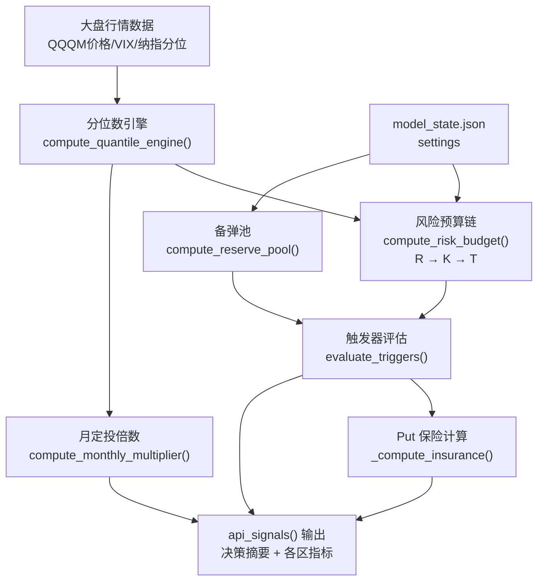

# TECHNICAL.md — 技术文档

> 相关文档：[CLAUDE.md](CLAUDE.md) 项目说明书 · [ARCHITECTURE.md](ARCHITECTURE.md) 系统架构 · [DESIGN.md](DESIGN.md) 页面样式

---

## 1. 接口设计

### 1.1 通用约定

- **Base URL（本地）**：`http://localhost:1001`
- **Content-Type**：`application/json`
- **写操作**：统一使用 POST，通过子路径区分语义（`/update`、`/delete`）
- **错误响应**：`{"error": "描述"}`，HTTP 4xx/5xx

### 1.2 接口详细文档

#### GET `/api/version`

能力探测，前端据此判断是否为本地全功能模式。

**响应示例：**
```json
{
  "edit_delete": true,
  "corp_actions": true
}
```

`edit_delete`：是否支持交易/出入金编辑删除；`corp_actions`：是否支持公司行为同步接口。

---

#### POST `/api/corp-actions/sync`

从 Yahoo Finance 拉取持仓标的的分红、拆股并**追加**写入 `trades.json`（不覆盖手动记录）。

**请求体（可选）：**
```json
{ "symbol": "QQQM" }
```
缺省或空对象表示对「当前交易中出现过的全部标的」逐一同步。

**响应示例：**
```json
{
  "ok": true,
  "inserted": [ { "date": "2026-03-30", "symbol": "QQQM", "type": "分红", "auto": true, "...": "..." } ],
  "skipped": [ { "symbol": "QQQM", "date": "2026-03-30", "kind": "div", "reason": "已存在自动分红" } ]
}
```

**业务规则摘要：**`type=分红` 的买入行 `price=0`，只增加股数、不增加持仓现金成本；`type=合股拆股` 为同日卖出旧持仓股数 + 买入新股数（`split_ratio` 与 Yahoo 一致），亦不改变 `total_cost`。MWRR 现金流、交易汇总中的佣金合计、收益图「加仓」散点等会排除上述记录。

**分红再投资股数公式（对齐 IB DRIP 口径）：**

```
shares = (div_per_share × shares_held_on_ex_date × (1 - 预扣税率)) / 付息日开盘价
```

其中：
- 预扣税率 `model_state.settings.dividend_withholding_rate`（默认 `0.30`，美股非居民默认；有 W-8BEN 协定时改 `0.10`；美国税务居民改 `0`）；合法区间 `[0, 0.5]`
- 付息日工作日偏移 `model_state.settings.dividend_reinvest_offset_bd`（默认 `5`，Invesco / SPDR 等常见 ETF；非典型 ETF 可在 `[0, 10]` 之间调整）
- 付息日开盘价拉取失败时自动回退到除息日收盘价（预扣税率仍生效）

**自动插入的分红行附带审计元数据：** `div_per_share`、`withholding_rate`、`pay_date`、`reinvest_price`、`gross_dividend_usd`；其中 `gross_dividend_usd` 为敏感字段，`compute.py` 预计算时会脱敏为 `null`。

**手工对账通道：** 公式与 IB 实际 VWAP 仍可能存在 0.01–0.1% 量级的微差（不同券商 DRIP 批量成交的加权均价略异）。`POST /api/trades/update` 允许对 **已自动生成的** 分红 / 合股拆股记录编辑 `shares`，原 `auto=true` 与元数据会被保留；手工 **新建** 该类型仍被拒绝，避免绕过同步流程产生重复记录。

---

#### GET `/api/fund-records`

返回全部出入金记录。

**响应示例：**
```json
[
  {
    "id": "20250101_001",
    "date": "2025-01-01",
    "amount": 10000.00,
    "note": "年初注入"
  }
]
```

#### POST `/api/fund-records`

新增出入金记录。

**请求体：**
```json
{
  "date": "2025-01-01",
  "amount": 10000.00,
  "note": "年初注入"
}
```

**字段校验：**`date`（YYYY-MM-DD）、`amount`（非零浮点数）必填，`note` 可选。

#### POST `/api/fund-records/update`

修改出入金记录。

**请求体：**`{"id": "...", "date": "...", "amount": ..., "note": "..."}`

#### POST `/api/fund-records/delete`

删除出入金记录。

**请求体：**`{"id": "..."}`

---

#### GET `/api/trades`

返回全部交易记录。

**响应示例：**
```json
[
  {
    "id": "20250103_QQQM_001",
    "date": "2025-01-03",
    "symbol": "QQQM",
    "action": "buy",
    "price": 87.50,
    "shares": 10,
    "commission": 0,
    "type": "定投"
  }
]
```

#### POST `/api/trades`

新增交易记录。

**字段说明：**

| 字段 | 类型 | 必填 | 说明 |
|------|------|------|------|
| `date` | string | 是 | 格式 YYYY-MM-DD |
| `symbol` | string | 是 | 股票代码（大写）|
| `action` | string | 是 | `buy` / `sell` |
| `price` | float | 是 | 成交价格 |
| `shares` | float | 是 | 股数（允许小数，部分股）|
| `commission` | float | 否 | 佣金，默认 0 |
| `type` | string | 否 | 交易类型标签（如"定投"/"投弹"）|

#### POST `/api/trades/update`

修改交易记录，请求体同新增，加 `id` 字段。

#### POST `/api/trades/delete`

删除交易记录。请求体：`{"id": "..."}`

---

#### GET `/api/trade-summary?period=<all|year|month>`

交易汇总统计。

**参数：**`period` = `all`（全部）| `year`（当年）| `month`（当月）

**响应字段：**总入金、总出金、总佣金、资金利用率、交易笔数、月度出入金明细。

---

#### GET `/api/returns-overview`

收益概览，计算量最大的端点，含 TWR/MWRR/回撤/风险指标/图表数据。

**响应结构：**
```json
{
  "periods": {
    "1d": {"twr": 0.012, "mwr": 0.011, "benchmark": 0.008},
    "mtd": {...},
    "ytd": {...},
    "1y": {...},
    "inception": {...}
  },
  "risk_metrics": {
    "max_drawdown": -0.18,
    "sharpe_ratio": 1.23,
    "alpha": 0.05,
    "beta": 0.92
  },
  "chart_data": {
    "dates": ["2025-01-01", ...],
    "portfolio": [100, 101.2, ...],
    "benchmark": [100, 100.8, ...],
    "dca": [100, 100.5, ...]
  },
  "drawdown_chart": {"dates": [...], "values": [...]},
  "strategy_driver": {
    "dca_contribution": 0.45,
    "tactical_contribution": 0.35,
    "cash_contribution": 0.20
  }
}
```

---

#### GET `/api/allocation`

当前持仓资产配置。

**响应字段：**各标的持仓（symbol, shares, current_price, market_value, weight, target_weight）、总市值、风险资产占比、避险资产占比。

---

#### GET `/api/asset-analysis/<symbol>`

单标的详细分析，含历史持仓、盈亏归因、交易明细。

---

#### GET `/api/signals`

天府模型 v1.3.1 信号与决策中心。详见 [§3 业务策略逻辑](#3-业务策略逻辑)。

**响应结构（摘要）：**
```json
{
  "model_version": "1.3.1",
  "updated_at": "2025-04-13 22:00",
  "summary": "当前建议：维持定投，暂停投弹",
  "market_status": {...},
  "quantile_engine": {...},
  "risk_budget": {"R": 3, "K": 0.6, "T": 24000},
  "reserve_pool": {"current": 18000, "health": 0.72},
  "triggers": [...],
  "monthly_dca": {...},
  "risk_control": {...}
}
```

---

#### GET `/api/strategy-review?period=<all|3m|1m>`

策略复盘评分与建议。

---

#### POST `/api/update-settings`

更新天府模型参数。

**请求体示例：**
```json
{
  "monthly_base": 2000,
  "qqqm_soft_pct": 70,
  "qqqm_hard_pct": 85
}
```

所有参数均有合法范围校验，超出范围返回 400 错误。

---

#### GET `/api/stress-test`

压力测试：极端情景冲击 + 蒙特卡洛模拟。前端入口在 **策略复盘 → 前瞻压测**（懒加载，点击「运行压力测试」后请求）。

**响应结构（摘要）：**
```json
{
  "scenarios": [
    {"name": "2020 疫情暴跌", "shock": -0.34, "portfolio_loss": -68000},
    {"name": "2022 熊市", "shock": -0.33, "portfolio_loss": -66000},
    ...
  ],
  "monte_carlo": {
    "simulations": 10000,
    "horizon_days": 252,
    "percentiles": {"p50": 210000, "p25": 180000, "p75": 245000, "p97.5": 310000}
  }
}
```

---

## 2. 数据结构

### 2.1 `data/trades.json`

```json
[
  {
    "id": "20250103_QQQM_001",
    "date": "2025-01-03",
    "symbol": "QQQM",
    "action": "buy",
    "price": 87.50,
    "shares": 10.0,
    "commission": 0.0,
    "type": "定投"
  }
]
```

| 字段 | 类型 | 说明 |
|------|------|------|
| `id` | string | 唯一 ID，格式 `YYYYMMDD_SYMBOL_SEQ` |
| `date` | string | YYYY-MM-DD |
| `symbol` | string | 股票代码（Yahoo Finance 格式，大写）|
| `action` | string | `buy` 或 `sell` |
| `price` | float | 成交价（美元）|
| `shares` | float | 股数（支持小数）|
| `commission` | float | 佣金（美元），默认 0 |
| `type` | string | 交易类型标签（自由文本）|

### 2.2 `data/fund_records.json`

```json
[
  {
    "id": "20250101_001",
    "date": "2025-01-01",
    "amount": 10000.0,
    "note": "年初注入"
  }
]
```

| 字段 | 类型 | 说明 |
|------|------|------|
| `id` | string | 唯一 ID，格式 `YYYYMMDD_SEQ` |
| `date` | string | YYYY-MM-DD |
| `amount` | float | 金额（正数=入金，负数=出金）|
| `note` | string | 备注说明 |

### 2.3 `data/model_state.json`

```json
{
  "settings": {
    "monthly_base": 2000,
    "yearly_reserve_inject": 40000,
    "initial_capital": 50000,
    "risk_free_rate": 0.021,
    "qqqm_soft_pct": 70,
    "qqqm_hard_pct": 85,
    "vix_threshold_high": 25,
    "vix_threshold_extreme": 35
  },
  "reserve_pool_history": [
    {"date": "2025-01-01", "amount": 50000, "event": "年初注入"}
  ],
  "last_updated": "2025-04-13T22:00:00"
}
```

`settings` 字段可通过 `/api/update-settings` 动态调整，每个参数均有合法范围校验。

### 2.4 `data/price_cache.json`

```json
{
  "version": 5,
  "cache_date": "2025-04-13",
  "prices": {
    "QQQM": {
      "history": [
        {"date": "2025-01-02", "close": 85.20},
        ...
      ],
      "realtime": {"price": 87.50, "change_pct": 0.012}
    }
  }
}
```

`version` 字段对应 `server.py` 中的 `_CACHE_VERSION` 常量，版本不匹配时全量失效重建。`cache_date` 为最后更新日期，同一交易日内复用缓存。

---

## 3. 业务策略逻辑

### 3.1 收益率计算

#### TWR（时间加权收益率）

消除出入金影响，反映纯投资能力。

计算步骤：
1. 按出入金时间点将区间分段
2. 计算每段子区间的简单收益率 `r_i = (V_end + CF) / V_start - 1`
3. 链接各子区间：`TWR = ∏(1 + r_i) - 1`

对应函数：`compute_twr()`（server.py:539）

#### MWRR（资金加权收益率）

反映实际现金流加权收益，考虑资金注入时机的影响。

计算方法：内部收益率（IRR），通过牛顿法求解 NPV=0 时的折现率。

对应函数：`compute_mwr()`（server.py:455），`_npv_mwr()`（server.py:442）

#### 回撤计算

```python
def _build_drawdown_series(portfolio_values):
    # 滚动最大值
    running_max = portfolio_values.cummax()
    # 回撤序列
    drawdown = (portfolio_values - running_max) / running_max
    # 最大回撤
    max_drawdown = drawdown.min()
```

对应函数：`_build_drawdown_series()`（server.py:694）

#### 风险指标

| 指标 | 计算公式 | 说明 |
|------|----------|------|
| 夏普比 | `√252 × mean(r_{p,d}-r_{f,d}) / std(r_{p,d}, ddof=1)` | `R_f` 为「美国 1 年期美债」FRED 序列 **DGS1** 最新有效值÷100（`/api/returns-overview` 按自然日内存缓存；抓取失败则用 `RISK_FREE_RATE_FALLBACK`） |
| Alpha | `R_p - R_{f,h} - β × (R_m - R_{f,h})`（区间总收益，**%** 展示） | Jensen：同源 `R_f`；`R_{f,h}=(1+R_f)^{n/252}-1`，`n` 为样本交易日数 |
| Beta | `Σ(r_p-\bar{r_p})(r_m-\bar{r_m}) / Σ(r_m-\bar{r_m})^2` | OLS 斜率，与样本协方差/方差比一致 |

对应函数：`compute_risk_metrics()`、`_sharpe_beta_jensen_pct_from_daily()`（server.py）

---

### 3.2 天府模型 v1.3.1

#### 整体决策流程



#### 分位数引擎

基于历史数据计算各指标的当前分位位置，判断市场估值高低。

- 数据源：yfinance 历史行情（默认 5 年）
- 分位阈值：`<20%` 极低（强买），`20–40%` 低，`40–60%` 中性，`60–80%` 高，`>80%` 极高（谨慎）
- 输出：各标的分位值 + 综合信号颜色

对应函数：`compute_quantile_engine()`（server.py:1745）

#### 风险预算链 R→K→T

| 变量 | 含义 | 计算方式 |
|------|------|----------|
| R（风险等级）| 1–5，当前市场风险评级 | 由分位数 + VIX 综合判断 |
| K（投弹系数）| 0.0–1.0，资金投入力度 | `K = f(R)`，等级越高系数越小 |
| T（投弹金额）| 本次投弹建议金额 | `T = K × 月投基数 × 倍数调整` |

对应函数：`compute_risk_budget()`（server.py:1892）

#### 备弹池管理

- 年初（1月1日）自动注入 `YEARLY_RESERVE_INJECT`（默认 40000）
- 每次投弹从备弹池扣减
- 健康度 = `current / initial`，低于 30% 发出警示

对应函数：`compute_reserve_pool()`（server.py:1671）

#### 渐进熔断机制

| 触发条件 | 状态 | 操作 |
|----------|------|------|
| QQQM 仓位 < `qqqm_soft_pct`（70%）| 正常 | 允许加仓 |
| QQQM 仓位 ≥ `qqqm_soft_pct`（70%）| 软熔断警示 | UI 警告，降低投弹系数 |
| QQQM 仓位 ≥ `qqqm_hard_pct`（85%）| 硬熔断 | 停止加仓信号 |

#### VIX 阈值触发

| VIX 值 | 信号 |
|--------|------|
| < `vix_threshold_high`（25）| 正常市场 |
| ≥ 25 | 波动警示，减少投弹 |
| ≥ `vix_threshold_extreme`（35）| 极端波动，考虑防御性操作 |

#### 触发器系统

`evaluate_triggers()` 综合评估多个条件，输出可执行信号列表，每个信号含：
- `priority`：`high` / `mid` / `low`
- `type`：`tactical`（投弹）/ `dca`（定投）/ `risk`（风控）
- `message`：可读文字建议
- `amount`：建议金额（可选）

---

### 3.3 蒙特卡洛模拟

基于历史日收益率分布，模拟未来 252 个交易日（约1年）的组合路径。

```python
# 参数化
mu = historical_daily_returns.mean()
sigma = historical_daily_returns.std()

# 10000 条路径
simulated = np.random.normal(mu, sigma, size=(10000, 252))
paths = initial_value * np.cumprod(1 + simulated, axis=1)
```

输出百分位：P2.5、P25、P50（中位数）、P75、P97.5。

对应函数：`api_stress_test()`（server.py:2639）

---

## 4. 风控规则

| 规则 | 触发条件 | 响应 |
|------|----------|------|
| QQQM 软熔断 | 仓位 ≥ 70% | UI 警示 Banner，投弹系数 ×0.5 |
| QQQM 硬熔断 | 仓位 ≥ 85% | 停止加仓，UI 红色警示 |
| VIX 高波动 | VIX ≥ 25 | 降低投弹建议金额 |
| VIX 极端波动 | VIX ≥ 35 | 建议考虑 Put 保险 |
| 备弹池低健康度 | 余额 < 30% | 限制投弹金额，提示补充 |
| 分位过高 | 综合分位 > 80% | 暂停投弹，降至定投模式 |

### Put 保险逻辑

当 VIX 极端或组合回撤超过阈值时，`_compute_insurance()` 计算建议的 Put 期权保险规模：

- 保险比例 = `f(VIX, drawdown, risk_level)`
- 建议保护金额 = `组合市值 × 保险比例`
- 输出：建议 Put 期权的行权价、到期日、仓位比例

---

## 5. 测试

> 测试规范速查见 [CLAUDE.md](CLAUDE.md#测试规范)，测试目录结构见 [ARCHITECTURE.md](ARCHITECTURE.md#测试架构)

### 5.1 测试框架配置

**安装开发依赖：**
```bash
pip3 install pytest>=8.0.0 pytest-cov>=5.0.0 ruff>=0.4.0
```

或通过 `requirements-dev.txt`：
```
pytest>=8.0.0
pytest-cov>=5.0.0
ruff>=0.4.0
```

**pytest.ini（规划）：**
```ini
[pytest]
testpaths = tests
python_files = test_*.py
python_classes = Test*
python_functions = test_*
addopts = -v --tb=short
```

**conftest.py 核心 fixture（规划）：**
```python
import pytest
import json
import shutil
from pathlib import Path
from unittest.mock import patch

FIXTURES_DIR = Path(__file__).parent / "fixtures"

@pytest.fixture
def app_with_test_data(tmp_path):
    """将 server.py 的数据目录重定向到 tmp_path，使用 fixtures/ 样本数据"""
    data_dir = tmp_path / "data"
    data_dir.mkdir()
    # 复制样本数据
    for f in ["trades.json", "fund_records.json", "model_state.json"]:
        shutil.copy(FIXTURES_DIR / f, data_dir / f)
    # monkeypatch DATA_DIR
    with patch("server.DATA_DIR", data_dir), \
         patch("server.FUND_FILE", data_dir / "fund_records.json"), \
         patch("server.TRADES_FILE", data_dir / "trades.json"), \
         patch("server.MODEL_STATE_FILE", data_dir / "model_state.json"), \
         patch("server.PRICE_CACHE_FILE", data_dir / "price_cache.json"):
        from server import app
        app.config["TESTING"] = True
        yield app.test_client()

@pytest.fixture
def mock_yfinance():
    """Mock yfinance 行情拉取，返回确定性历史数据"""
    mock_data = ...  # 标准化样本历史价格
    with patch("yfinance.Ticker") as mock_ticker:
        mock_ticker.return_value.history.return_value = mock_data
        yield mock_ticker
```

### 5.2 测试分层策略

| 层次 | 文件 | 覆盖范围 | 优先级 |
|------|------|----------|--------|
| 单元测试 | `test_business.py` | 纯函数：TWR/MWRR/回撤/风险指标/分位数/蒙特卡洛 | P0 |
| API 测试（CRUD）| `test_crud.py` | 出入金 + 交易的增删改查、边界条件 | P0 |
| API 测试（只读）| `test_readonly_api.py` | 全部 GET 端点的 200 响应 + 字段完整性 | P1 |
| 集成测试 | `test_compute.py` | compute.py 脱敏正确性 + 预计算输出完整性 | P1 |
| 静态数据 | `test_backtest_data.py` | `data/backtest/*.json` 结构、与明细行数一致、日期单调 | P2 |
| 回测风险值 | `test_backtest_alpha_beta.py` | `compute_alpha_beta_from_returns` 合成序列单测 + 三档周期 α/β 非零断言 | P2 |

**回测 Excel α / β 兜底约定**：`scripts/import_backtest.py` 默认透传 Excel「指标汇总」Alpha/Beta 值；当两者同为 0（Excel 公式在 30 年跨度下失败的典型哨兵，如 QQQM/QLD 无 30 年历史）时自动用 `nav.json` + yfinance `^IXIC` 做 CAPM 回归补算：β 取 1% / 99% winsorize 的日收益协方差/方差比（去除资金注入尖峰），α 取 `summary.cagr_pct` 作为可信年化（避免 NAV 含注入导致 α 被高估）再减 β × CAGR_bench。补算仅在 0/0 哨兵触发，已有非零值保留 Excel 口径；强制全量覆盖需加 `--force`。

### 5.3 关键测试用例设计

#### CRUD 测试要点（test_crud.py）

```
出入金：
  ✓ 新增正常出入金记录
  ✓ 新增缺少必填字段（date/amount）→ 400
  ✓ 删除存在的记录
  ✓ 重复删除同一记录 → 适当错误
  ✓ 修改 amount 和 note
  ✓ 空数据状态下列表查询 → []

交易：
  ✓ 新增 buy/sell 记录
  ✓ 缺少 symbol/action → 400
  ✓ 删除交易记录
  ✓ 修改 action/date/price/shares
  ✓ shares 为小数（部分股）
```

#### 只读 API 测试要点（test_readonly_api.py）

```
✓ GET /api/version → 200，含 version 字段
✓ GET /api/fund-records → 200，返回列表
✓ GET /api/trades → 200，返回列表
✓ GET /api/trade-summary?period=all → 200
✓ GET /api/trade-summary?period=year → 200
✓ GET /api/trade-summary?period=month → 200
✓ GET /api/returns-overview → 200，含 periods/risk_metrics/chart_data
✓ GET /api/allocation → 200，含持仓数据
✓ GET /api/asset-analysis/QQQM → 200（需要样本数据含 QQQM）
✓ GET /api/signals → 200，含 quantile_engine/risk_budget
✓ GET /api/strategy-review?period=all → 200
✓ GET /api/stress-test → 200，含 scenarios/monte_carlo
```

#### 业务逻辑单元测试要点（test_business.py）

```
TWR：
  ✓ 无出入金时 TWR = 简单收益率
  ✓ 多次出入金时各子区间链接正确
  ✓ 空交易历史时安全处理

MWRR：
  ✓ 单笔投入 MWRR = 总收益率
  ✓ 定期定额投资的 MWRR 合理性验证

风险指标：
  ✓ 夏普比公式正确（年化系数 √252）
  ✓ 最大回撤 = 历史峰值到谷值的最大降幅
  ✓ Beta 计算与基准相关性

分位数引擎：
  ✓ 当前价格在历史中处于 0% 分位时信号为极低
  ✓ 当前价格在历史中处于 100% 分位时信号为极高
```

#### compute.py 测试要点（test_compute.py）

```
脱敏验证：
  ✓ trades 响应中 price/shares/commission 字段被置 None
  ✓ fund-records 响应中 amount 字段被置 None
  ✓ allocation 响应中 market_value/avg_cost 被置 None
  ✓ 脱敏后 symbol/date/action 等非敏感字段保留

预计算完整性：
  ✓ 所有端点均生成对应 .json 文件
  ✓ 生成的 JSON 文件可被正常解析（合法 JSON）
  ✓ compute.py 运行返回 exit code 0
```

### 5.4 覆盖率目标

| 阶段 | 目标覆盖率 | 说明 |
|------|------------|------|
| 起步 | ≥40% | CRUD + 主要 GET 端点测试完成后 |
| 中期 | ≥60% | 业务逻辑单元测试加入后 |
| 长期 | ≥75% | 完整覆盖天府模型核心路径后 |

### 5.5 Lint 规范

**ruff 配置（`ruff.toml` 或 `pyproject.toml`，规划）：**
```toml
[tool.ruff]
line-length = 120
target-version = "py311"
select = ["E", "W", "F", "I"]
ignore = ["E501"]  # 长行在 server.py 中常见，暂不强制
```

---

## 6. 部署

### 6.1 本地开发

```bash
cd ~/Documents/Cursor/us-stock-trading-assistant
pip3 install -r requirements.txt
python3 server.py
# 访问 http://localhost:1001
```

### 6.2 CI/CD 流水线

**compute.yml**（现有）：

```yaml
触发：
  - push to main
  - schedule:
      # 盘中每 30 min（EDT 9:00-17:30 / EST 8:00-16:30 覆盖）
      - cron: '0,30 13-21 * * 1-5'
      # 收盘后 2h 终版快照（EDT 18:00 / EST 17:00）
      - cron: '0 22 * * 1-5'
  - workflow_dispatch
步骤：
  1. checkout
  2. setup-python 3.11 + pip cache
  3. pip install -r requirements.txt
  4. base64 -d Secrets → data/*.json
  5. python3 compute.py
  6. git add data/computed/ && git commit（[skip ci]）
  7. git push；失败则 git pull --rebase -X theirs 后重试（最多 5 次退避）
```

盘中 cron 依赖 yfinance 对"今天"返回一行临时 Close（以最新成交价为收盘价），
推进 `effective_end_date = trading_dates[-1]` 到当日；收盘终版再抓一次，避免
Yahoo 延迟丢最终收盘价。周末与节假日因 `1-5` 与无新数据自然跳过。

**test.yml**（规划）：

```yaml
name: Tests
on: [push, pull_request]
jobs:
  test:
    runs-on: ubuntu-latest
    steps:
      - uses: actions/checkout@v4
      - uses: actions/setup-python@v5
        with:
          python-version: '3.11'
      - run: pip install -r requirements.txt -r requirements-dev.txt
      - run: ruff check .
      - run: |
          # 使用 fixtures/ 样本数据创建 data/ 目录
          mkdir -p data
          cp tests/fixtures/trades.json data/
          cp tests/fixtures/fund_records.json data/
          cp tests/fixtures/model_state.json data/
          python3 -m pytest tests/ -v --cov=server --cov-report=xml --cov-fail-under=40
```

### 6.3 GitHub Secrets 管理

```bash
# 本地同步 Secrets（需安装 gh CLI）
./sync-secrets.sh

# 手动同步单个 Secret
gh secret set TRADES_B64 < <(base64 -i data/trades.json)
gh secret set FUND_RECORDS_B64 < <(base64 -i data/fund_records.json)
gh secret set MODEL_STATE_B64 < <(base64 -i data/model_state.json)
```

### 6.4 GitHub Pages 配置

仓库 Settings → Pages → Source：`main` 分支，根目录 `/`。

`index.html` 在根目录，通过 `window.location.hostname === '<user>.github.io'` 自动切换为云端模式。

### 6.5 CI 写回 main 的竞态守护

**适用范围：** 任何 workflow 的 `git commit && git push` 写回 `main`。

**为何必要：** 本仓库同时存在以下几条 push 路径，两两可能撞车：

1. 用户自己 `git push origin main`
2. `.githooks/pre-push` 的 CHANGELOG bump 触发的第二次 push
3. `compute.yml` 在盘中 cron（`0,30 13-21 * * 1-5`）下每 30 min 一次的写回
4. `compute.yml` 相邻两个 run 时间窗重叠时互相撞车

任一对并发 push 都会让后者遭遇 `! [rejected] main -> main (fetch first)`，run 整次失败
→ 线上数据当次刷新丢失。

**守护模板（务必复用）：**

```yaml
- name: Commit computed data
  run: |
    set -e
    git config user.name "github-actions[bot]"
    git config user.email "github-actions[bot]@users.noreply.github.com"
    git add <被写回的路径>
    if git diff --cached --quiet; then
      echo "No changes to commit"; exit 0
    fi
    git commit -m "chore: <describe> [skip ci]"
    for attempt in 1 2 3 4 5; do
      if git push; then exit 0; fi
      echo "push rejected on attempt $attempt, rebase and retry..."
      git fetch origin main
      git pull --rebase -X theirs origin main
      sleep $((attempt * 3))
    done
    exit 1
```

**语义要点：**

- `-X theirs` 在 rebase 路径冲突时偏向 `origin` 版本——CI 的增值仅在写回的数据路径上，其它路径冲突应让远端胜出。
- `set -e` + `if git push` 组合：`git push` 的失败被 `if` 吞掉进入 rebase 重试；`fetch` / `pull` 的硬失败（网络/真冲突）按 `set -e` 立即 fail-fast，交给人工处置。
- 退避 `sleep $((attempt * 3))` 避免对远端做雷暴重试。

**测试守护：** `tests/test_compute_workflow_cron.py::test_commit_step_has_push_retry` 静态断言 YAML 里 `for`/`rebase`/`fetch` 三要素齐备，防止未来被静默回滚。

---

## 7. 运维

### 7.1 价格缓存管理

缓存文件 `data/price_cache.json` 按交易日自动失效，无需手动清理。

若需强制刷新缓存，递增 `server.py` 中的 `_CACHE_VERSION` 常量（当前为 6）。

### 7.2 数据备份

```bash
# 手动备份（建议定期执行）
cp data/trades.json backups/trades_$(date +%Y%m%d).json
cp data/fund_records.json backups/fund_records_$(date +%Y%m%d).json
cp data/model_state.json backups/model_state_$(date +%Y%m%d).json
```

通过 `sync-secrets.sh` 同步到 GitHub Secrets 也是一种异地备份方式。

### 7.3 Secret 同步频率建议

- 新增交易记录后立即同步
- 每月月底同步一次
- 每次调整模型参数（`model_state.json`）后同步

---

## 8. 日志与监控

### 8.1 当前状态

- Flask 以 `debug=True` 启动（仅本地开发），输出请求日志到 stdout
- 无结构化日志，无日志文件持久化
- CI 运行日志通过 GitHub Actions 查看

### 8.2 关键日志点（server.py 中）

- 价格缓存命中/失效：`print(f"Cache version mismatch: ...")`
- yfinance 拉取失败：`print(f"Warning: failed to fetch {sym}: {e}")`
- compute.py 端点失败：`print(f"ERROR {endpoint}: HTTP {status}")`

### 8.3 yfinance 并发安全规则（已验证）

yfinance 在多线程并发调用 `yf.download()` 时依赖模块级共享字典（`_DFS`/`_ERRORS`），会发生数据串台（见 [ranaroussi/yfinance#2557](https://github.com/ranaroussi/yfinance/issues/2557)）。典型症状：^VIX / ^TNX 被写成 QQQM 的股价（如三者均为 ~110）。

**规则**：
- 所有 yfinance 历史数据拉取（`Ticker.history` / `yf.download`）必须经过 `_YFIN_HISTORY_FETCH_LOCK` 互斥
- `_fetch_histories_raw` 内部按顺序逐标的拉取，禁止再用 `ThreadPoolExecutor` 并行 `_pull_one`
- `fetch_realtime_quote` 同样持锁（60 秒 TTL 缓存命中后不进入锁，无性能影响）
- 引入任何新的并发拉取场景前，必须先核查目标库的线程安全状态

**防御纵深**：
1. `_YFIN_HISTORY_FETCH_LOCK` 进程级互斥（硬防）
2. `_repair_quantile_vix_tnx_if_equity_leak` 语义校验 + 自动重拉（软防）
3. `_QUANTILE_ENGINE_VERSION` 递增让当日磁盘缓存失效（缓存防护）

### 8.4 未来规划

- 引入 Python `logging` 模块替代 `print`，支持日志级别控制
- 生产部署（若有）时关闭 `debug=True`
- 考虑添加请求耗时日志（yfinance 拉取可能较慢）

---

## 9. 静态文件与 URL 路由约定

Flask 以 `Flask(__name__, static_folder=".")` 初始化，**只暴露显式注册的路由**；磁盘上的 `data/` 目录不会被自动映射到 URL。凡前端 `fetch('./data/<子目录>/...')` 必须在 `server.py` 中对应一条显式静态路由，否则本地模式将返回 404（云端 GitHub Pages 由静态托管代为服务，会掩盖此类遗漏）。

| 前端 URL | 部署形态 A（本地 Flask: 1001） | 部署形态 B（GitHub Pages） |
|---|---|---|
| `/api/*` | 显式 `@app.route` | 不可用（改走预计算 `./data/computed/*.json`）|
| `./data/computed/*.json` | 当前未暴露（仅云端使用）；若将来本地需要预览云端模式，需加 `@app.route("/data/computed/<path:filename>")` | 静态文件直出 |
| `./data/backtest/*.json` | `@app.route("/data/backtest/<path:filename>")` → `send_from_directory(BASE_DIR/"data"/"backtest", ...)` | 静态文件直出 |

新增任何"前端直读磁盘 JSON"的 Tab 时必须同时：
1. 在 `server.py` 加一条 `send_from_directory` 路由
2. 用 `send_from_directory` 而非手写 `open(...)`，利用其 `safe_join` 阻止 `..` 路径遍历
3. 新增 HTTP 层测试（`tests/test_xxx_static_route.py`）验证 200 + 404 两条路径——filesystem schema 测试**不足以**证明 URL 可达
